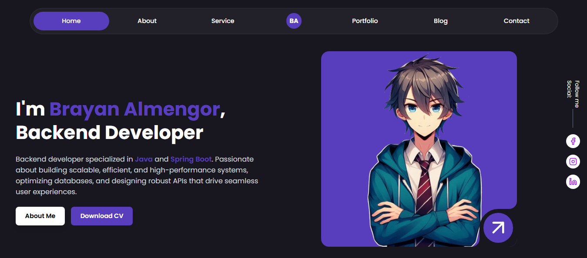

<div align="center">


</div>

<h1 align="center">PORTFOLIO - DESING BENTO V2</h1>
<div align="center">


This is the update of my web portfolio. One of my intentions is to make a striking and modern design like the bento type design. I am a backend developer and I do my best since I am not so good with the frontend. Greetings.

Website developed by [brayanalmengor04](https://github.com/brayanalmengor04) thanks for visiting the repository. 
</div> 



## 🛠️ Technologies

- [Astro 5](https://astro.build)
- [TailwindCSS 4](https://tailwindcss.com)

## 🔧 Install

Install dependencies

```sh
npm install
```

Start the project in development mode

```sh
npm run dev
```

