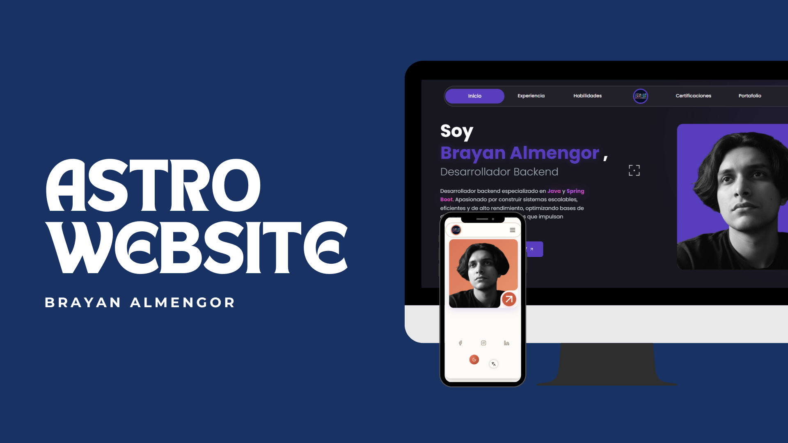

<div align="center">


</div>

<h1 align="center">PORTFOLIO - MODERN SHOWCASE</h1>

<div align="center">


[](https://app.netlify.com/projects/brayanalmengorpty/deploys)

**A modern, responsive portfolio website with bento grid design showcasing professional projects and experience.**

🌐 **[View Live Demo](https://brayanalmengorpty.netlify.app/)** | 📧 **[Contact Me](mailto:brayanalmengor300@gmail.com)**

Website developed by [brayanalmengor04](https://github.com/brayanalmengor04) - Backend Developer passionate about building scalable systems.

</div>

---



## ✨ Features

- 🌐 **Bilingual Support** - Full internationalization (i18n) in Spanish and English
- 🚀 **Production Status Tracking** - Visual badges showing which projects are live in production
- 🎨 **Modern Bento Grid Design** - Clean, contemporary layout inspired by modern UI trends
- 📱 **Fully Responsive** - Optimized for all devices (mobile, tablet, desktop)
- ⚡ **Lightning Fast** - Built with Astro for optimal performance and SEO
- 🎯 **Smart Project Filtering** - Category-based filtering (Web, Android, UI/UX, Bot)
- 🌙 **Dark/Light Mode** - Seamless theme switching with smooth transitions
- 🎭 **Premium Animations** - Smooth micro-interactions using Framer Motion
- 📊 **Professional Experience Timeline** - Showcasing work history and achievements
- 🎓 **Certifications Showcase** - Interactive carousel displaying professional certifications

## 🛠️ Tech Stack

### Frontend
- **[Astro 5](https://astro.build)** - Static Site Generator for optimal performance
- **[React](https://react.dev)** - Component library for interactive elements
- **[TailwindCSS 4](https://tailwindcss.com)** - Utility-first CSS framework
- **[Framer Motion](https://www.framer.com/motion/)** - Animation library

### Features & Tools
- **i18n** - Custom internationalization implementation
- **React Icons** - Icon library (Simple Icons, Font Awesome)
- **EmailJS** - Contact form integration with rate limiting
- **SweetAlert2** - Beautiful alert modals

### Deployment
- **[Netlify](https://www.netlify.com/)** - Continuous deployment and hosting

## 📁 Project Structure

```
brayanalmengor04.github.io/
├── public/
│   ├── image/
│   │   ├── proyects/        # Project screenshots
│   │   └── logo/            # Brand assets
│   └── file/
│       └── certifications/  # PDF certificates
├── src/
│   ├── components/          # React components
│   │   ├── ProjectGallery.jsx
│   │   ├── CertificationsCarousel.jsx
│   │   └── ContactSection.jsx
│   ├── sections/            # Astro page sections
│   │   ├── Hero.astro
│   │   ├── Service.astro
│   │   ├── Proyects.astro
│   │   └── Contact.astro
│   ├── data/                # Project data
│   │   └── proyectData.js
│   ├── i18n/                # Internationalization
│   │   ├── ui.ts            # Translation strings
│   │   └── utils.ts         # i18n utilities
│   ├── layouts/             # Page layouts
│   │   └── Layout.astro
│   └── pages/               # Routes
│       ├── index.astro
│       └── [lang]/index.astro
└── package.json
```

## 🚀 Getting Started

### Prerequisites

- **Node.js** (v18 or higher)
- **npm** or **yarn**

### Installation

1. **Clone the repository**
   ```bash
   git clone https://github.com/brayanalmengor04/brayanalmengor04.github.io.git
   cd brayanalmengor04.github.io
   ```

2. **Install dependencies**
   ```bash
   npm install
   ```

3. **Start development server**
   ```bash
   npm run dev
   ```

4. **Open in browser**
   ```
   http://localhost:4321
   ```

### Available Scripts

| Command | Description |
|---------|-------------|
| `npm run dev` | Start development server at `localhost:4321` |
| `npm run build` | Build production site to `./dist/` |
| `npm run preview` | Preview production build locally |
| `npm run astro` | Run Astro CLI commands |

## 📦 Build & Deployment

### Build for Production

```bash
npm run build
```

This generates a static site in the `./dist/` directory optimized for production.

### Deploy to Netlify

1. **Push to GitHub**
   ```bash
   git add .
   git commit -m "Update portfolio"
   git push origin main
   ```

2. **Netlify Auto-Deploy**
   - Netlify automatically detects changes and deploys
   - Build command: `npm run build`
   - Publish directory: `dist`

## 🌐 Internationalization (i18n)

The portfolio supports two languages:

- **Spanish (es)** - Default language
- **English (en)** - Secondary language

Language switching is handled through URL routing:
- Spanish: `https://brayanalmengorpty.netlify.app/`
- English: `https://brayanalmengorpty.netlify.app/en/`

All content is managed in `src/i18n/ui.ts` for easy translation updates.

## 🎯 Key Features Explained

### Production Status Badges
Projects marked with `isProduction: true` display a green "LIVE" badge with a rocket icon, indicating they're actively deployed.

```javascript
// Example in proyectData.js
portfolio: {
  isProduction: true,
  productionUrl: "https://brayanalmengorpty.netlify.app/",
  githubLink: "https://github.com/username/repo"
}
```

### Project Categorization
Projects are organized into categories:
- **Web** - Full-stack web applications
- **Android** - Native mobile apps
- **UI/UX** - Design projects
- **Bot** - Discord bots and automation

### Dark/Light Mode
Theme switching with CSS custom properties ensures smooth transitions and proper color contrast in both modes.

## 📧 Contact

- **GitHub**: [@brayanalmengor04](https://github.com/brayanalmengor04)
- **LinkedIn**: [Brayan Almengor](https://www.linkedin.com/in/brayan-antonio)
- **Email**: brayanalmengor300@gmail.com
- **Portfolio**: [brayanalmengorpty.netlify.app](https://brayanalmengorpty.netlify.app/)

## 📄 License

This project is licensed under the MIT License - see the [LICENSE](LICENSE) file for details.

## 🙏 Acknowledgments

- Design inspiration from modern bento grid layouts
- Icons from [React Icons](https://react-icons.github.io/react-icons/)
- Deployed on [Netlify](https://www.netlify.com/)

---

<div align="center">

**⭐ If you like this project, please give it a star! ⭐**

Made with ❤️ by [Brayan Almengor](https://github.com/brayanalmengor04)

</div>
